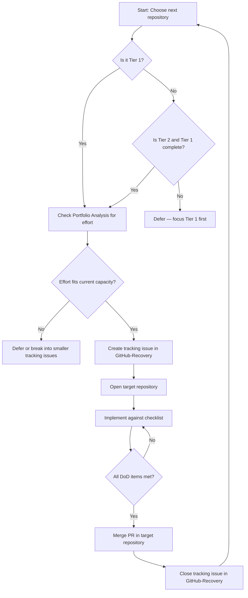

# Portfolio Improvement Workflow

Execution framework for improving Showcase repositories. This document defines **how** portfolio work is planned, tracked, and completed. It does not contain repository-specific tasks.

## Purpose

Sprint 3 moves from analysis to action. The inventory, classification, and showcase reports identify **what** to improve. This workflow defines **how** that improvement happens across two distinct repositories:

| Repository | Role |
|---|---|
| **GitHub-Recovery** | Portfolio management — planning, tracking, reporting |
| **Target portfolio repository** | Independent software project — all implementation work |

Each portfolio repository remains its own project with its own commits, branches, issues, and pull requests.

---

## Design Principle

GitHub Recovery is the command center. Portfolio repositories are the work sites.

When improving a repository:

1. **Create a tracking issue** in `Lakhwinderr/GitHub-Recovery`.
2. **Open the target repository** separately in Cursor or your editor.
3. **Perform all implementation** inside that repository.
4. **Create commits, branches, issues, and pull requests** inside that repository.
5. **Return to GitHub-Recovery** and close the tracking issue when the work is complete.

Never mix portfolio implementation code into GitHub-Recovery. Never track portfolio progress only inside the target repository without a corresponding tracking issue here.

---

## Overall Workflow

```
Planning (GitHub-Recovery)
        ↓
Select repository from showcase reports
        ↓
Create tracking issue in GitHub-Recovery
        ↓
Open target repository
        ↓
Plan and implement improvements in target repository
        ↓
Review against common improvement checklist
        ↓
Merge changes in target repository
        ↓
Close tracking issue in GitHub-Recovery
        ↓
Update inventory / reports if classification changed
```

### Step-by-step

#### 1. Select a repository

Use the showcase reports to decide what to work on next:

- [Portfolio Shortlist](../reports/showcase/portfolio-shortlist.md) — Tier 1 repositories are the immediate focus.
- [Portfolio Analysis](../reports/showcase/portfolio-analysis.md) — effort estimates, target audience, and technology context.
- [Portfolio Roadmap](../reports/showcase/portfolio-roadmap.md) — recommended improvement sequence per Tier 1 repository.

Work on **one repository at a time**. Finish or deliberately pause before starting the next.

#### 2. Create a tracking issue in GitHub-Recovery

Open an issue in `Lakhwinderr/GitHub-Recovery` that records the improvement effort. This issue lives here — not in the target repository.

Every tracking issue should include:

- **Objective** — what portfolio outcome this work achieves.
- **Target repository** — name and link (e.g. `Lakhwinderr/FreshHireAI`).
- **Scope** — which checklist sections apply (see [Common Improvement Checklist](../reports/showcase/common-improvement-checklist.md)).
- **Definition of Done** — checklist items that must be satisfied before closing.

Follow [prompts/create-issue.md](../prompts/create-issue.md) for project management conventions (milestone, labels, assignee).

#### 3. Open the target repository

Clone or open the target repository in a separate workspace. All code, documentation, and asset changes happen there.

If the target repository needs its own breakdown, create issues **inside that repository** — not in GitHub-Recovery.

#### 4. Implement improvements

Work through the [Common Improvement Checklist](../reports/showcase/common-improvement-checklist.md) and the per-repository steps in the [Portfolio Roadmap](../reports/showcase/portfolio-roadmap.md).

Follow the target repository's existing conventions for code style, folder structure, and tooling.

#### 5. Review and merge in the target repository

- Open a pull request in the target repository.
- Verify all in-scope checklist items are complete.
- Merge after review.

#### 6. Close the tracking issue in GitHub-Recovery

Return to GitHub-Recovery and close the tracking issue. Reference the merged pull request from the target repository.

If the repository's category, priority, or notes changed, update `reports/repository-inventory.md` and regenerate reports as needed.

---

## Decision Flow

Use this flow to decide whether and when to start improving a repository.



### Decision rules

| Question | Guidance |
|---|---|
| Which repository first? | Tier 1 repositories in [Portfolio Shortlist](../reports/showcase/portfolio-shortlist.md). Within Tier 1, prefer repositories marked P1 with smaller estimated effort unless a flagship project (e.g. FreshHireAI) is actively in development. |
| One repo or many? | One repository in progress at a time in GitHub-Recovery. Multiple agents may work on different repositories only when each has a separate tracking issue and independent target-repo workspace. |
| What counts as done? | All checklist items in scope for that tracking issue are satisfied, changes are merged in the target repository, and a final recruiter review is complete. |
| When to update reports? | After a repository's status materially changes — e.g. moved from private to public, reclassified, or notes no longer accurate. |
| Destructive actions? | Never delete, archive, or change visibility without explicit approval. See [.cursor/rules/github-recovery.mdc](../.cursor/rules/github-recovery.mdc). |

---

## Repository Lifecycle

Each portfolio repository moves through defined states. GitHub-Recovery tracks the state via tracking issues; the target repository holds the actual code and documentation.

| State | Location | Description |
|---|---|---|
| **Identified** | GitHub-Recovery reports | Repository classified as Showcase in inventory. Listed in shortlist with tier and priority. |
| **Planned** | GitHub-Recovery | Tracking issue created. Scope and Definition of Done documented. No implementation started. |
| **In Progress** | Target repository | Active branch, commits, and pull requests in the target repository. Tracking issue remains open. |
| **Under Review** | Target repository | Pull request open. Checklist verification in progress. |
| **Complete** | Both | Changes merged in target repository. Tracking issue closed in GitHub-Recovery. Repository meets in-scope checklist items. |
| **Maintained** | Both | Repository stays portfolio-ready. New tracking issues created only for significant updates. |

### State transitions

```
Identified → Planned        Create tracking issue
Planned → In Progress       First commit on feature branch in target repo
In Progress → Under Review  Open pull request in target repo
Under Review → Complete     Merge PR + close tracking issue
Complete → Maintained       No action required until new improvement needed
Complete → Planned          New tracking issue for additional polish
```

A repository can return to **Planned** or **In Progress** at any time after completion if new improvement work is identified.

---

## Branch Strategy

GitHub-Recovery and each portfolio repository follow separate branching models. Branches never cross repository boundaries.

### GitHub-Recovery branches

Used for planning documents, reports, scripts, and tracking-issue-related changes within this repository.

| Branch | Purpose |
|---|---|
| `main` | Stable project documentation and reports |
| `feature/<topic>` | New workflow docs, report updates, script changes |

Examples:

- `feature/portfolio-improvement-plan` — workflow documentation (this issue)
- `feature/update-inventory` — inventory or report regeneration

Tracking issues for portfolio repositories do **not** require a branch in GitHub-Recovery unless the issue also changes files here (e.g. closing an issue after updating inventory notes).

### Target repository branches

All implementation branches live in the target repository.

| Branch | Purpose |
|---|---|
| `main` / `master` | Stable, portfolio-ready code |
| `feature/<improvement>` | README, documentation, code quality, or visual improvements |

Examples:

- `feature/readme-improvement`
- `feature/add-screenshots`
- `feature/code-cleanup`

### Pull request flow

```
Target repository:
  feature/<improvement> → main   (implementation PR)

GitHub-Recovery (only when files here change):
  feature/<topic> → main         (planning / report PR)
```

Rules:

- One focused pull request per improvement theme in the target repository.
- Reference the GitHub-Recovery tracking issue number in the target-repo PR description.
- Reference the target-repo PR URL when closing the GitHub-Recovery tracking issue.
- Never force-push to `main`.
- Never mix changes from two portfolio repositories in one branch.

---

## Supporting Documents

| Document | Role in this workflow |
|---|---|
| [Portfolio Shortlist](../reports/showcase/portfolio-shortlist.md) | Prioritization — which repositories to improve |
| [Portfolio Analysis](../reports/showcase/portfolio-analysis.md) | Context — effort, audience, technology |
| [Portfolio Roadmap](../reports/showcase/portfolio-roadmap.md) | Sequence — recommended steps per Tier 1 repository |
| [Common Improvement Checklist](../reports/showcase/common-improvement-checklist.md) | Quality standard — Definition of Done |
| [Repository Review Guide](repository-review-guide.md) | Inventory tool — update classifications when status changes |
| [Vision](vision.md) | Goals and principles |
| [Roadmap](roadmap.md) | Sprint milestones |

---

## Safety

All GitHub Recovery safety rules apply during portfolio improvement:

- AI drafts changes; you approve every permanent action.
- No automatic deletion, archiving, or visibility changes.
- No force-push.
- Ask before any destructive action.

Implementation safety in the target repository follows that repository's own conventions, but visibility and deletion decisions always require explicit approval.
